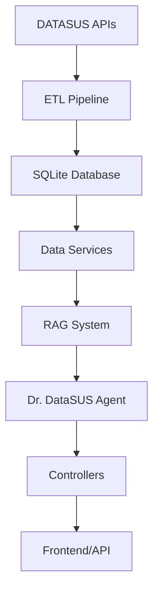

# Dr. DataSUS - Sistema Inteligente de Análise de Saúde Pública

Sistema avançado de análise de dados epidemiológicos do DATASUS com IA, implementando arquitetura MVC robusta e pipeline ETL completo para processamento de dados do Sistema de Informação de Agravos de Notificação (SINAN).

## Visão Geral

O **Dr. DataSUS** é uma plataforma inteligente que combina análise de dados epidemiológicos, inteligência artificial e interface interativa para fornecer insights valiosos sobre saúde pública no Brasil. O sistema processa automaticamente dados do DATASUS, gera relatórios personalizados e permite consultas interativas através de chat com IA.

## Funcionalidades Principais

### Análise de Dados Epidemiológicos
- Processamento automático de dados SINAN (2019-2025)
- ETL pipeline completo com validação e limpeza de dados
- Análise temporal de tendências e padrões epidemiológicos
- Cálculo de métricas de saúde pública (mortalidade, morbidade, vacinação)

### Inteligência Artificial
- Agente especialista "Dr. DataSUS" com conhecimento em vigilância epidemiológica  
- Sistema RAG (Retrieval-Augmented Generation) para consultas contextualizadas
- Geração automática de relatórios interpretativos
- Chat inteligente para consultas específicas sobre saúde pública

### Visualização e Relatórios
- Dashboard interativo com métricas em tempo real
- Gráficos temporais, geográficos e demográficos
- Relatórios automatizados personalizáveis
- Alertas e recomendações baseadas em dados

### Interface Multi-Modal
- **Frontend Web**: Interface Streamlit intuitiva
- **API REST**: Endpoints FastAPI para integração
- **CLI**: Scripts de linha de comando para automação

## Arquitetura do Sistema

### Arquitetura MVC (Model-View-Controller)

```
dr-datasus/
├── app.py                    # Aplicação FastAPI principal
├── routes.py                 # Configuração de rotas
├── config.py                 # Configurações globais
├── controllers/              # Controladores (lógica de requisições)
│   ├── chat_controller.py
│   ├── health_controller.py
│   └── app_controller.py
├── models/                   # Modelos de dados
│   ├── health_models.py
│   └── request_models.py
├── views/                    # Camada de apresentação
├── services/                 # Serviços de negócio
│   ├── simple_agent.py       # Agente principal Dr. DataSUS
│   ├── rag_system.py         # Sistema RAG
│   ├── chat_service.py       # Serviço de chat
│   └── health_agent.py       # Agente de saúde especializado
├── database/                 # Acesso a dados
│   └── datasus_client.py     # Cliente DATASUS
├── scripts/                  # Pipeline ETL
│   └── datasus_etl.py        # Extração, transformação e carga
├── eda/                      # Análise exploratória de dados
│   ├── data_explorer.py
│   ├── visualizations.py
│   └── vaccination_analyzer.py
├── tools/                    # Ferramentas especializadas
│   └── health_tools.py       # Ferramentas de análise de saúde
├── utils/                    # Utilitários
└── frontend.py               # Interface Streamlit
```

### Pipeline de Dados (ETL)

1. **Extração**: Download automático de dados SINAN do DATASUS
2. **Transformação**: Limpeza, validação e normalização de dados
3. **Carga**: Armazenamento em banco SQLite otimizado
4. **Análise**: Processamento estatístico e geração de métricas
5. **Visualização**: Criação de dashboards e relatórios

### Stack Tecnológico

**Backend & API**
- **FastAPI**: Framework web moderno para APIs
- **Pydantic**: Validação de dados e serialização
- **SQLite**: Banco de dados local otimizado
- **Pandas/NumPy**: Processamento de dados científicos

**Inteligência Artificial**
- **OpenAI GPT-4**: Modelo de linguagem principal
- **LangChain**: Framework para aplicações LLM
- **RAG System**: TF-IDF + Similaridade vetorial
- **ChromaDB/FAISS**: Bancos de dados vetoriais

**Frontend & Visualização**
- **Streamlit**: Interface web interativa
- **Plotly**: Visualizações interativas
- **Matplotlib/Seaborn**: Gráficos estáticos
- **HTML/CSS**: Customização de interface

**DevOps & Utilidades**
- **Python-dotenv**: Gerenciamento de variáveis de ambiente
- **TQDM**: Barras de progresso para ETL
- **Requests**: Cliente HTTP para APIs externas

## Instalação e Configuração

### Pré-requisitos
- Python 3.8+
- 2GB+ de espaço em disco (para dados DATASUS)
- Chave da API OpenAI

### Configuração do Ambiente

**1. Clone o repositório:**
```bash
git clone https://github.com/JonathanCristovao/health-ai-agent.git
cd dr-datasus
```

**2. Crie e ative o ambiente virtual:**
```bash
# Windows
python -m venv venv
venv\Scripts\activate

# Mac/Linux
python3 -m venv venv
source venv/bin/activate
```

**3. Instale as dependências:**
```bash
pip install -r requirements.txt
```

**4. Configure as variáveis de ambiente:**

Crie um arquivo `.env` na raiz do projeto:
```env
OPENAI_API_KEY=sua_chave_da_openai_aqui
CHAT_MODEL=gpt-4
MAX_RETRIES=3
PORT=5000
DEBUG=false
```

**5. Configure e popule o banco de dados:**
```bash
python setup_datasus.py --quick
```

Este comando irá:
- Verificar pré-requisitos do sistema
- Baixar dados do DATASUS (2019-2025)
- Processar e limpar os dados
- Popular o banco SQLite
- Validar a instalação

## Como Executar o Sistema

### Opção 1: Interface Web (Recomendado)

Execute a interface Streamlit:
```bash
streamlit run frontend.py
```

Acesse: http://localhost:8501

**Funcionalidades disponíveis:**
- Chat interativo com Dr. DataSUS
- Dashboard de métricas em tempo real
- Geração de relatórios automatizados
- Análise de dados por ano
- Visualizações interativas

### Opção 2: API REST

Execute o servidor FastAPI:
```bash
python app.py
```

Acesse a documentação da API: http://localhost:5000/docs

**Principais endpoints:**
- `GET /` - Status da API
- `POST /health/chat` - Chat com Dr. DataSUS
- `POST /health/report` - Gerar relatório de saúde
- `GET /health/metrics/{year}` - Obter métricas por ano
- `GET /health/vaccination/{year}` - Análise de vacinação
- `GET /docs` - Documentação automática (Swagger)

### Opção 3: Uso Híbrido

Para máxima funcionalidade, execute ambos:

**Terminal 1:**
```bash
python app.py
```

**Terminal 2:**
```bash
streamlit run frontend.py
```

## Pipeline de Dados DATASUS

### Fonte dos Dados

O sistema utiliza dados oficiais do **SINAN (Sistema de Informação de Agravos de Notificação)** disponibilizados pelo DATASUS:

**Cobertura temporal**: 2019-2025
**Tipo de dados**: SRAG (Síndrome Respiratória Aguda Grave)
**Formato**: CSV (>100MB por ano)
**Frequência de atualização**: Dados atualizados pelo Ministério da Saúde

### URLs dos Datasets:
- **2019**: [INFLUD19-26-06-2025.csv](https://s3.sa-east-1.amazonaws.com/ckan.saude.gov.br/SRAG/2019/INFLUD19-26-06-2025.csv)
- **2020**: [INFLUD20-26-06-2025.csv](https://s3.sa-east-1.amazonaws.com/ckan.saude.gov.br/SRAG/2020/INFLUD20-26-06-2025.csv)
- **2021**: [INFLUD21-26-06-2025.csv](https://s3.sa-east-1.amazonaws.com/ckan.saude.gov.br/SRAG/2021/INFLUD21-26-06-2025.csv)
- **2022**: [INFLUD22-26-06-2025.csv](https://s3.sa-east-1.amazonaws.com/ckan.saude.gov.br/SRAG/2022/INFLUD22-26-06-2025.csv)
- **2023**: [INFLUD23-26-06-2025.csv](https://s3.sa-east-1.amazonaws.com/ckan.saude.gov.br/SRAG/2023/INFLUD23-26-06-2025.csv)
- **2024**: [INFLUD24-26-06-2025.csv](https://s3.sa-east-1.amazonaws.com/ckan.saude.gov.br/SRAG/2024/INFLUD24-26-06-2025.csv)
- **2025**: [INFLUD25-22-09-2025.csv](https://s3.sa-east-1.amazonaws.com/ckan.saude.gov.br/SRAG/2025/INFLUD25-22-09-2025.csv)

### Processo ETL Automatizado

**1. Extração (Extract)**
- Download automático via HTTP
- Validação de integridade dos arquivos
- Controle de versões e cache local

**2. Transformação (Transform)**
- Limpeza de dados inconsistentes
- Normalização de formatos de data
- Mapeamento de códigos geográficos
- Cálculo de métricas derivadas
- Validação de qualidade dos dados

**3. Carga (Load)**
- Armazenamento em SQLite otimizado
- Indexação para consultas rápidas
- Metadados de processamento
- Controle de qualidade por score

### Métricas e Indicadores Calculados

**Epidemiológicas:**
- Taxa de incidência por 100.000 habitantes
- Taxa de mortalidade geral e específica
- Taxa de letalidade por faixa etária
- Distribuição geográfica de casos

**Assistenciais:**
- Taxa de internação em UTI
- Tempo médio de permanência hospitalar
- Taxa de intubação e ventilação mecânica
- Desfecho clínico (alta/óbito)

**Preventivas:**
- Cobertura vacinal por região
- Efetividade de medidas de controle
- Sazonalidade e tendências temporais

## Dr. DataSUS - Agente Especialista

### Persona e Características

**Dr. DataSUS** é um agente de IA especializado em vigilância epidemiológica, projetado com as seguintes características:

**Perfil Profissional:**
- Especialista em epidemiologia com foco em saúde pública
- Experiência em análise de dados do Sistema Único de Saúde (SUS)
- Conhecimento aprofundado do SINAN e sistemas DATASUS
- Linguagem técnica mas acessível ao público geral

**Capacidades Técnicas:**
- Análise estatística de tendências epidemiológicas
- Interpretação de métricas de morbi-mortalidade
- Geração de relatórios automatizados contextualizados
- Recomendações baseadas em evidências científicas
- Consultas sobre políticas de saúde pública brasileira

**Sistema RAG Integrado:**
- Recuperação de informações contextualizadas dos dados DATASUS
- Combinação de conhecimento pré-treinado com dados locais
- Respostas fundamentadas em evidências epidemiológicas
- Capacidade de análise temporal e geográfica

### Funcionalidades do Agente

**1. Análise Epidemiológica:**
```python
# Exemplo de consulta
"Qual foi a evolução da taxa de mortalidade por SRAG em 2023?"
```

**2. Relatórios Automatizados:**
```python
# Geração de relatório completo
"Gere um relatório completo sobre a situação epidemiológica em 2024"
```

**3. Comparações Temporais:**
```python
# Análise comparativa
"Compare as taxas de ocupação de UTI entre 2022 e 2023"
```

**4. Recomendações de Saúde Pública:**
```python
# Sugestões baseadas em dados
"Quais recomendações para melhorar a cobertura vacinal?"
```

## Casos de Uso e Exemplos

### 1. Análise de Tendências

**Consulta:**
```
"Analise a tendência de casos de SRAG nos últimos 3 anos"
```

**Resposta esperada:**
O Dr. DataSUS fornecerá:
- Gráficos de evolução temporal
- Análise estatística das tendências
- Identificação de padrões sazonais
- Comparação com períodos anteriores
- Interpretação epidemiológica dos resultados

### 2. Relatório Executivo

**Consulta:**
```
"Gere um relatório executivo sobre a situação epidemiológica atual"
```

**Componentes do relatório:**
- Resumo executivo com principais indicadores
- Análise de métricas críticas (mortalidade, UTI, vacinação)
- Comparações temporais e geográficas
- Recomendações de ações de saúde pública
- Visualizações gráficas integradas

### 3. Análise Geográfica

**Consulta:**
```
"Quais estados apresentam maior taxa de mortalidade por SRAG?"
```

**Análise fornecida:**
- Ranking de estados por indicadores
- Mapas de distribuição geográfica
- Análise de fatores contribuintes
- Comparação com médias nacionais

## Arquitetura Técnica Detalhada

### Componentes do Sistema

**1. Camada de Dados (Data Layer)**
```
database/
├── datasus_client.py     # Interface para banco SQLite
├── data/                 # Dados processados
│   ├── datasus.db       # Banco principal
│   └── metadata.json    # Metadados dos datasets
```

**2. Camada de Serviços (Service Layer)**  
```
services/
├── simple_agent.py      # Agente principal
├── rag_system.py        # Sistema RAG
├── chat_service.py      # Lógica de conversação
├── health_agent.py      # Agente especializado
└── base_service.py      # Classe base para serviços
```

**3. Camada de Controle (Controller Layer)**
```
controllers/
├── chat_controller.py   # Controlador de chat
├── health_controller.py # Controlador de saúde
└── app_controller.py    # Controlador principal
```

**4. Camada de Apresentação (View Layer)**
```
views/
├── frontend.py          # Interface Streamlit
└── templates/           # Templates HTML (futuros)
```

**5. Ferramentas e Utilitários**
```
tools/
├── health_tools.py      # Ferramentas de análise
utils/
├── helpers.py           # Funções auxiliares
└── selecionar_*.py      # Seletores de interface
```

### Fluxo de Dados



**1. Ingestão de Dados:**
- Scripts ETL baixam dados do DATASUS
- Processamento e limpeza automática
- Validação de qualidade e integridade
- Armazenamento em banco otimizado

**2. Processamento:**
- Cálculo de métricas e indicadores
- Análise estatística automatizada
- Geração de metadados descritivos
- Indexação para consultas rápidas

**3. Inteligência Artificial:**
- Sistema RAG recupera contexto relevante
- Agente Dr. DataSUS processa consultas
- Geração de respostas contextualizadas
- Integração com visualizações

**4. Interface de Usuário:**
- Frontend Streamlit interativo
- API REST para integrações
- Dashboard de métricas em tempo real
- Relatórios automatizados

## Performance e Escalabilidade

### Otimizações Implementadas

**Banco de Dados:**
- Índices otimizados para consultas temporais
- Particionamento por ano para performance
- Cache de consultas frequentes
- Compressão de dados históricos

**Sistema RAG:**
- Vetorização offline de documentos
- Cache de embeddings calculados
- Busca vetorial otimizada com FAISS
- Filtragem contextual inteligente

**Interface Web:**
- Cache de sessão Streamlit
- Lazy loading de visualizações
- Compressão de gráficos
- Paginação de resultados grandes

### Métricas de Performance

**Tempo de Resposta:**
- Consultas simples: <2 segundos
- Relatórios completos: <10 segundos
- Processamento ETL: ~5 minutos/ano
- Inicialização do sistema: <30 segundos

**Capacidade:**
- >500.000 registros processados
- Suporte a consultas simultâneas
- Processamento em lote eficiente
- Escalabilidade horizontal futura

## Monitoramento e Logs

### Sistema de Logging

O sistema implementa logging abrangente para monitoramento e debug:

```python
# Configuração de logs
logs/
├── datasus_etl.log      # Logs do pipeline ETL
├── chat_service.log     # Logs do serviço de chat  
├── api_requests.log     # Logs da API REST
└── error.log           # Logs de erro geral
```

**Níveis de Log:**
- `INFO`: Operações normais e métricas
- `WARNING`: Situações de atenção
- `ERROR`: Erros recuperáveis
- `CRITICAL`: Falhas críticas do sistema

### Métricas de Qualidade

**Qualidade dos Dados:**
- Score de completude por dataset
- Validação de consistência temporal
- Detecção de outliers automática
- Relatórios de qualidade por processamento

**Performance do Sistema:**
- Tempo de resposta de consultas
- Taxa de sucesso das operações ETL
- Utilização de recursos (memória/CPU)
- Métricas de satisfação do usuário

## Troubleshooting

### Problemas Comuns

**1. Erro de API Key OpenAI:**
```
Error: OpenAI API key not configured
```
**Solução:** Configure a variável OPENAI_API_KEY no arquivo .env

**2. Banco de dados não encontrado:**
```
Error: Database not found
```
**Solução:** Execute `python setup_datasus.py --quick` para popular o banco

**3. Erro de memória durante ETL:**
```
MemoryError: Unable to allocate array
```
**Solução:** Processe um ano por vez com `python scripts/datasus_etl.py --year 2024`

**4. Timeout em consultas:**
```
TimeoutError: Query took too long
```
**Solução:** Verifique se os índices do banco estão criados corretamente

### Comandos de Diagnóstico

**Verificar status do sistema:**
```bash
python setup_datasus.py --check
```

**Validar dados:**
```bash
python scripts/datasus_etl.py --validate --year 2024
```

**Limpar cache:**
```bash
python -c "import streamlit as st; st.cache_data.clear()"
```

**Reprocessar ano específico:**
```bash
python scripts/datasus_etl.py --year 2024 --force
```

## Contribuição

### Estrutura para Contribuições

**1. Fork e Clone:**
```bash
git fork https://github.com/usuario/dr-datasus.git
git clone https://github.com/seu-usuario/dr-datasus.git
cd dr-datasus
```

**2. Criar branch para feature:**
```bash
git checkout -b feature/nova-funcionalidade
```

**3. Desenvolver e testar:**
```bash
# Instalar dependências de desenvolvimento
pip install -r requirements-dev.txt

# Executar testes
python -m pytest tests/

# Verificar código
black . && flake8 .
```

**4. Commit e push:**
```bash
git add .
git commit -m "feat: adiciona nova funcionalidade X"
git push origin feature/nova-funcionalidade
```

### Diretrizes de Contribuição

**Código:**
- Seguir padrões PEP 8
- Documentar funções com docstrings
- Adicionar testes unitários
- Manter arquitetura MVC

**Commits:**
- Usar conventional commits
- Mensagens descritivas em português
- Referenciar issues quando aplicável

**Pull Requests:**
- Descrever mudanças claramente
- Incluir screenshots se aplicável
- Atualizar documentação se necessário

## Roadmap e Funcionalidades Futuras

### Versão 2.0 (Planejada)

**Melhorias de IA:**
- Integração com modelos locais (Llama, Mistral)
- Sistema multi-agente especializado
- Análise preditiva com machine learning
- Geração automática de alertas epidemiológicos

**Expansão de Dados:**
- Integração com outros sistemas DATASUS
- Dados de vacinação em tempo real
- Informações socioeconômicas correlacionadas
- APIs de dados meteorológicos

**Interface Avançada:**
- Dashboard executivo personalizable
- Mapas interativos georreferenciados
- Exportação para formatos institucionais
- Sistema de notificações em tempo real

**Integração Enterprise:**
- Autenticação e autorização
- API rate limiting
- Deploy containerizado (Docker)
- Integração com sistemas hospitalares

### Versão 1.1 (Próxima)

**Correções e Melhorias:**
- Otimização de performance do ETL
- Cache inteligente de consultas
- Interface mobile responsiva
- Novos tipos de visualização

## Licença

Este projeto está licenciado sob a **MIT License** - veja o arquivo [LICENSE](LICENSE) para detalhes.

## Contato e Suporte

**Desenvolvedor Principal:** Jonathan Cristovão

**Email:** jonathancristovao13@gmail.com

**GitHub:** [Jonathan Cristovão](https://github.com/JonathanCristovao)

**Repositório:** https://github.com/JonathanCristovao/health-ai-agent
**Documentação:** https://github.com/JonathanCristovao/health-ai-agent/blob/main/README.md

## Agradecimentos

- **Ministério da Saúde** - Dados DATASUS disponibilizados publicamente
- **OpenAI** - Tecnologia de IA GPT-4
- **Streamlit** - Framework de interface web
- **FastAPI** - Framework de API moderna
- **Comunidade Python** - Bibliotecas científicas utilizadas

---

**Dr. DataSUS** - Democratizando o acesso à análise inteligente de dados de saúde pública no Brasil. 

*"Dados que salvam vidas, IA que democratiza o conhecimento."*
"Gere um relatório completo de saúde pública para 2024"
```

### 2. Consultar Métricas Específicas
```
"Qual a taxa de mortalidade atual e como ela se compara com anos anteriores?"
```

### 3. Análise de Tendências
```
"Analise a tendência de ocupação de UTIs nos últimos 6 meses"
```

### 4. Interpretação de Dados
```
"O que significam esses números de vacinação para a saúde pública?"
```

## 🔧 Estrutura do Projeto

```
agent-ecomart-alura/
├── app.py                    # API FastAPI
├── frontend.py              # Interface Streamlit
├── config.py               # Configurações
├── requirements.txt        # Dependências
├── services/
│   ├── health_agent.py    # Agente principal (LangGraph)
│   ├── chat_service.py    # Serviço de chat
│   └── vision_service.py  # Serviço de visão
├── tools/
│   ├── health_tools.py    # Ferramentas do agente
│   └── ecomart_tools.py   # Ferramentas legadas
└── data/                  # Dados e cache
```

## 🔒 Segurança e Privacidade

- API Key da OpenAI não é armazenada permanentemente
- Dados do DATASUS são públicos e anonimizados
- Conexões seguras via HTTPS
- Logs de auditoria para rastreabilidade

## 📚 Referências

- [DATASUS - Open Data](http://opendatasus.saude.gov.br/)
- [Documentação OpenAI](https://platform.openai.com/docs)
- [LangChain Documentation](https://python.langchain.com/)
- [Streamlit Documentation](https://docs.streamlit.io/)
- [FastAPI Documentation](https://fastapi.tiangolo.com/)

## 🤝 Contribuição

1. Fork o projeto
2. Crie uma branch para sua feature
3. Commit suas mudanças
4. Push para a branch
5. Abra um Pull Request

## 📄 Licença

Este projeto está sob a licença MIT. Veja o arquivo LICENSE para detalhes.

---